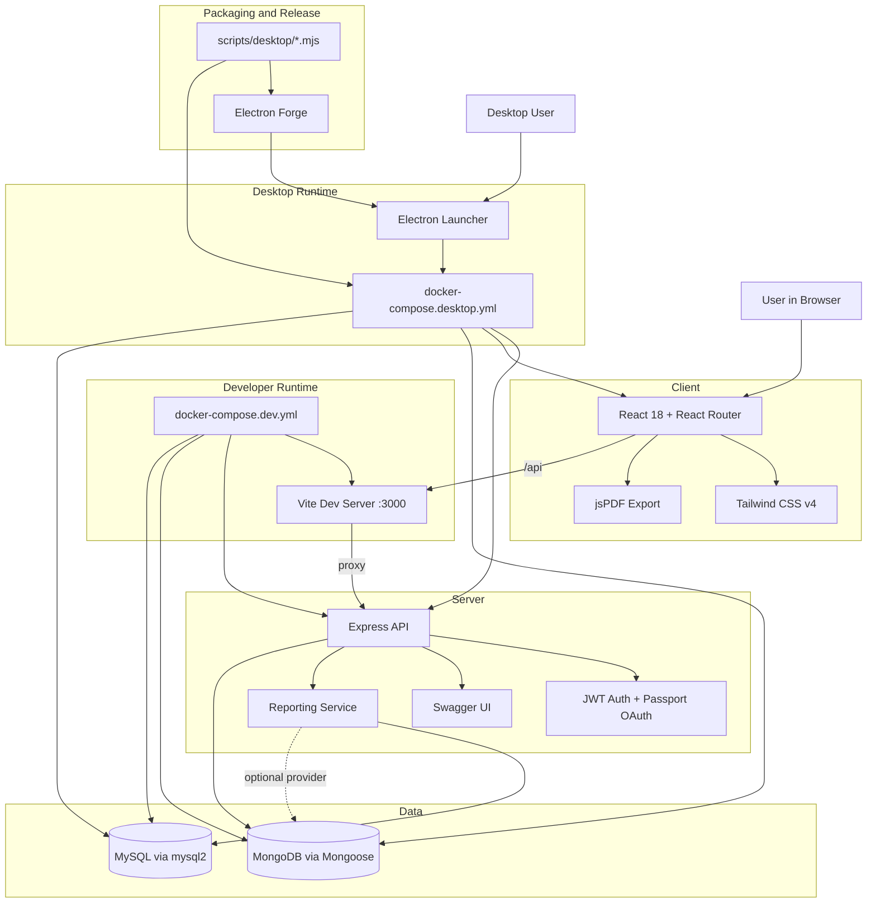

# Condo App One-Page Architecture Diagram

Back to the overview: [condo-app-technical-stack.md](./condo-app-technical-stack.md)

## System Diagram

## Reading Notes

- The primary product surface is the React web app.
- The API server is the integration point for auth, condo routes, and report generation.
- MongoDB holds core application entities, while MySQL is the default reporting backend.
- The Electron launcher is a local orchestration layer, not a separate business backend.
- Docker Compose is the main runtime boundary tying the web client, API server, and databases together.

## Related Documents

- Overview: [condo-app-technical-stack.md](./condo-app-technical-stack.md)
- Folder walkthrough: [condo-app-stack-by-folder.md](./condo-app-stack-by-folder.md)
